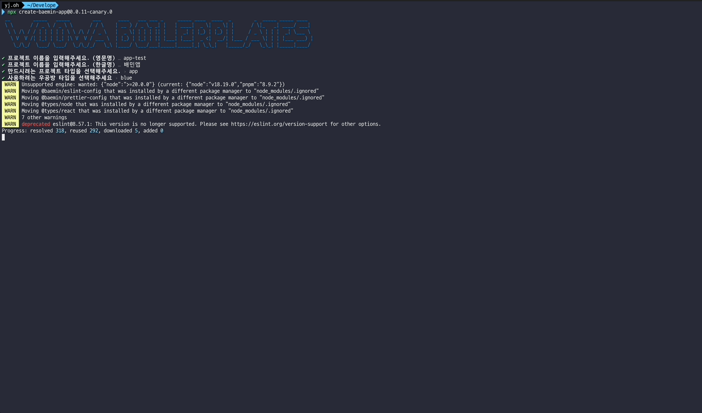
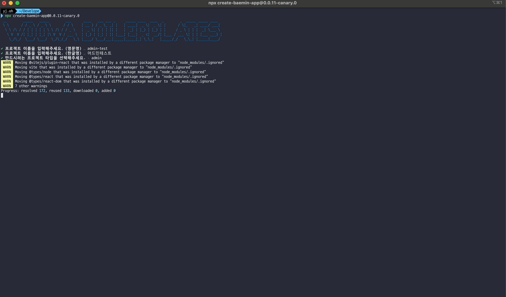

### 1. 프로젝트 시작하기

필요한 환경을 준비하고 보일러플레이트를 사용하여 프로젝트를 생성하는 방법을 설명합니다.

#### 1.0. 환경 준비하기

보일러플레이트를 사용하기 위해서는 다음 환경이 필요합니다.

- [Node.js](https://nodejs.org/en/download/) 버전 20.x 이상
- [pnpm](https://pnpm.io/) 버전 8.x 이상

#### 1.1. 프로젝트 생성하기

노드가 설치된 환경에서 다음 명령어를 실행하여 보일러플레이트로 프로젝트를 생성할 수 있습니다.

```bash
npx create-boilerplate-app
```

#### 1.2. CLI 프롬프트를 통해 원하는 설정 선택하기

프로젝트 생성 명령어를 실행하면 CLI 프롬프트가 나타납니다. 원하는 설정을 선택하고 엔터를 눌러주세요.

- 프로젝트 이름 (영문)
- 프로젝트 표시 이름
- 프로젝트 유형 (app / admin)
- 디자인 시스템 테마 (primary / secondary) - app 프로젝트인 경우

#### 1.3. 프로젝트 실행하기

생성된 프로젝트 위치로 이동하여 다음 명령어를 실행하면 개발 서버가 실행됩니다.

```bash
cd my-app
pnpm install
pnpm run dev
```

### 2. 지원하는 프로젝트 종류

#### 2.1. App 프로젝트

클라이언트 사이드 렌더링(CSR) 웹 애플리케이션을 위한 템플릿입니다.



#### 2.2. Admin 프로젝트

관리자 대시보드 애플리케이션을 위한 템플릿입니다. Ant Design 기반의 UI 컴포넌트를 사용합니다.



#### 2.3. Library 프로젝트

재사용 가능한 라이브러리를 위한 템플릿입니다.

### 3. 프로젝트 종류별 디자인 시스템

#### 3.1. App 프로젝트

App 프로젝트에서는 Primary/Secondary 테마를 선택할 수 있습니다.

- CLI 프롬프트에서 Primary 버전과 Secondary 버전을 선택하여 프로젝트를 생성할 수 있습니다.

#### 3.2. Admin 프로젝트

Admin 프로젝트에서는 [Ant Design](https://ant.design/) 디자인 시스템을 사용합니다.

- 풍부한 UI 컴포넌트
- 반응형 레이아웃 지원
- 다크 모드 지원
